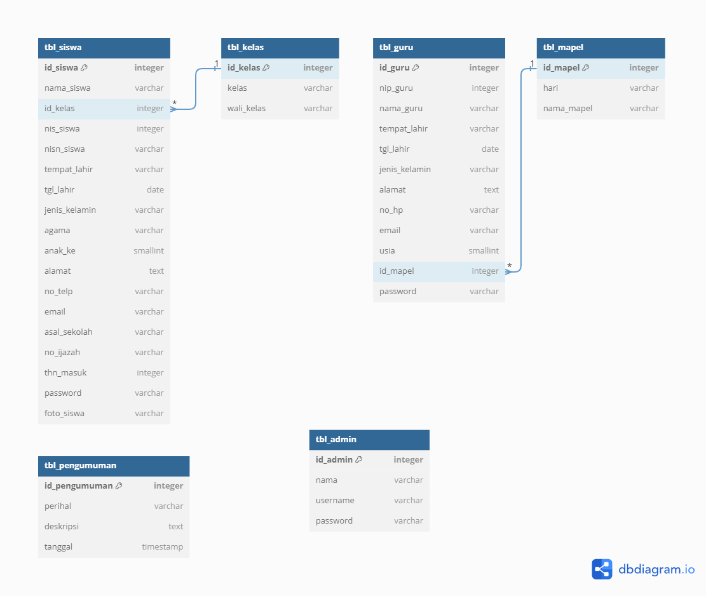
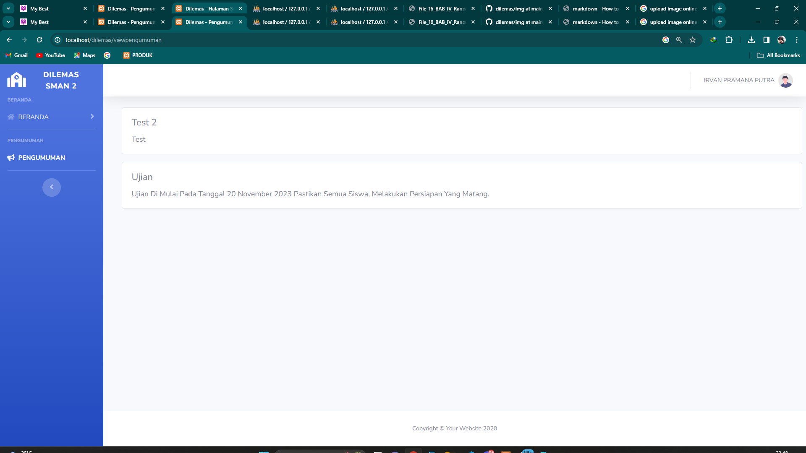

*******************
Server Requirements
*******************

PHP version 5.6.
XAMMP Old Version You Can Download Here: 
https://sourceforge.net/projects/xampp/files/XAMPP%20Windows/5.6.38/

************
Installation
************

Please see the `installation section <https://codeigniter.com/userguide3/installation/index.html>`_
of the CodeIgniter User Guide.

************
ERD Database & Relationship
************

Tampilan Siswa

************
Login Siswa
************

************
Home Siswa
************

************
Data Siswa
************

************
Pengumuman
************

Tampilan Guru

************
Login Guru
************

************
Home Guru
************

************
Data Guru
************

************
Pengumuman
************

Tampilan Admin

************
Login Admin
************

************
Home Admin
************

************
Crud Data Siswa
************

************
Crud Data Guru
************

************
Crud Pengumuman
************

